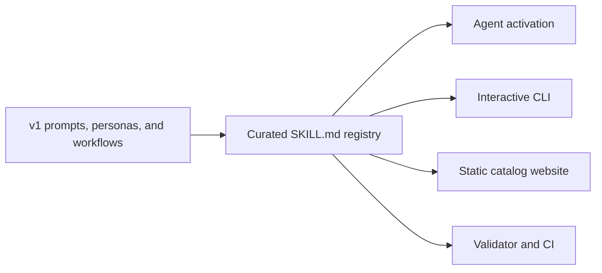

<div align="center">

# Fieldskills

### Practical judgment, packaged for agents.

An open library of portable Agent Skills for technical discovery, solution design, demos,
commercial decisions, career moves, research, and the work between them.

[](https://github.com/WBHankins93/prompt-library/actions/workflows/validate-skills.yml)
[](#explore-the-library)
[](#explore-the-library)
[](LICENSE)

[Explore skills](#explore-the-library) ·
[Try one now](#try-a-skill-in-60-seconds) ·
[Use the CLI](#select-skills-with-the-cli) ·
[Run the website](#run-the-website) ·
[Contribute](#contribute-a-skill)

</div>

---

## Choose your path

| I want to… | Go here |
|---|---|
| Find judgment for a job I need to do | [Explore the library](#explore-the-library) |
| Give an agent one skill right now | [Try a skill in 60 seconds](#try-a-skill-in-60-seconds) |
| Select several skills interactively | [Use the Fieldskills CLI](#select-skills-with-the-cli) |
| Browse the visual catalog locally | [Run the Next.js website](#run-the-website) |
| Add or improve a skill | [Follow the contribution path](#contribute-a-skill) |
| Understand why this changed from prompts to skills | [Read the evolution story](docs/evolution.md) |

## What is a Fieldskill?

A Fieldskill is a focused `SKILL.md` file that tells an agent **when to activate**, **how to
exercise judgment**, **what good looks like**, and **which shortcuts to refuse**.

It is smaller than a persona, sharper than a generic prompt, and portable across Agent
Skills-compatible assistants.

<details>
<summary><strong>Open the anatomy of a skill</strong></summary>

```text
skills/
└── <author>/
    ├── author.md
    └── <skill-name>/
        ├── SKILL.md
        └── references/       # optional deeper material
```

Every `SKILL.md` includes:

- activation-focused `name`, `title`, and `description`
- a stable category and useful tags
- source provenance, semantic version, and update date
- operating judgment, a quality bar, and explicit hard rules

The complete contract lives in the [skill specification](docs/skill-spec.md).

</details>

<details>
<summary><strong>See how the repository fits together</strong></summary>



The `skills/` tree is the source of truth. The website and CLI read it directly; the validator
enforces its portable format.

</details>

## Explore the library

Pick a track, expand it, and open the skill that matches the outcome you need.

<details open>
<summary><strong>Solutions Engineering core · 9 skills</strong></summary>

| Category | Skill | Use it when… |
|---|---|---|
| Discovery | [Run technical discovery](skills/ben-hankins/run-technical-discovery/SKILL.md) | You need the real problem, stakeholders, constraints, and success criteria before scoping. |
| POC design | [Scope a POC](skills/ben-hankins/scope-a-poc/SKILL.md) | You need a bounded evaluation with explicit proof, ownership, and exit conditions. |
| Technical demos | [Deliver a technical demo](skills/ben-hankins/deliver-a-technical-demo/SKILL.md) | You need a demo that proves the buyer's outcome instead of touring features. |
| Technical demos | [Recover a failed demo](skills/ben-hankins/recover-a-failed-demo/SKILL.md) | A live demo breaks and you need to preserve trust while regaining control. |
| Stakeholders | [Navigate stakeholders](skills/ben-hankins/navigate-stakeholders/SKILL.md) | Technical, business, and political audiences need different evidence. |
| Solution design | [Make an architecture decision](skills/ben-hankins/make-an-architecture-decision/SKILL.md) | A consequential technical choice needs explicit trade-offs and a durable rationale. |
| Solution design | [Design for operability](skills/ben-hankins/design-for-operability/SKILL.md) | A design must survive production ownership, incidents, and change. |
| Solution design | [Threat-model a design](skills/ben-hankins/threat-model-a-design/SKILL.md) | You need to identify trust boundaries, abuse paths, and proportionate controls. |
| Objections | [Handle objections](skills/ben-hankins/handle-objections/SKILL.md) | A concern needs diagnosis and evidence rather than reflexive rebuttal. |

</details>

<details>
<summary><strong>Building and delivery · 3 skills</strong></summary>

| Category | Skill | Use it when… |
|---|---|---|
| Product | [Design an AI feature](skills/ben-hankins/design-an-ai-feature/SKILL.md) | An AI capability needs a defensible user outcome, evaluation plan, and failure boundaries. |
| Engineering | [Ship to production](skills/ben-hankins/ship-to-production/SKILL.md) | A change must move through testing, delivery, rollback, and operational readiness. |
| Commercial | [Onboard a new client](skills/ben-hankins/onboard-a-new-client/SKILL.md) | A signed customer needs a controlled transition from promise to realized value. |

</details>

<details>
<summary><strong>Business and commercial · 8 skills</strong></summary>

| Category | Skill | Use it when… |
|---|---|---|
| Commercial | [Price and propose](skills/ben-hankins/price-and-propose/SKILL.md) | You need to turn scope, value, risk, and terms into a credible proposal. |
| Commercial | [Build a content strategy](skills/ben-hankins/build-a-content-strategy/SKILL.md) | Content needs a clear audience, point of view, distribution system, and learning loop. |
| Business | [Build a GTM plan](skills/ben-hankins/build-a-gtm-plan/SKILL.md) | A product needs a focused path to its first repeatable customers. |
| Business | [Write a business plan](skills/ben-hankins/write-a-business-plan/SKILL.md) | Market evidence, economics, operations, and milestones must form one operating document. |
| Business | [Assess venture viability](skills/ben-hankins/assess-venture-viability/SKILL.md) | You are deciding whether to start, fund, acquire, continue, or stop a venture. |
| Business | [Pressure-test projections](skills/ben-hankins/pressure-test-projections/SKILL.md) | A forecast or investment case needs its assumptions and sensitivities exposed. |
| Business | [Red-team a plan](skills/ben-hankins/red-team-a-plan/SKILL.md) | A costly or hard-to-reverse decision needs serious disconfirming analysis. |
| Business | [Productize a service](skills/ben-hankins/productize-a-service/SKILL.md) | Custom delivery is limiting consistency, margin, or independence from the owner. |

</details>

<details>
<summary><strong>Career and personal decisions · 6 skills</strong></summary>

| Category | Skill | Use it when… |
|---|---|---|
| Career | [Tailor a resume](skills/ben-hankins/tailor-a-resume/SKILL.md) | Your evidence needs to match a specific role without inventing claims. |
| Career | [Write a cover letter](skills/ben-hankins/write-a-cover-letter/SKILL.md) | You need a concise case connecting your evidence to an employer's actual need. |
| Career | [Prep for an interview](skills/ben-hankins/prep-for-an-interview/SKILL.md) | You need role-specific stories, questions, rehearsal, and risk preparation. |
| Career | [Plan a career move](skills/ben-hankins/plan-a-career-move/SKILL.md) | You are comparing roles, industries, paths, or timing under uncertainty. |
| Career | [Develop a skill fast](skills/ben-hankins/develop-a-skill-fast/SKILL.md) | Competence must improve quickly for a real performance context. |
| Business | [Make a major purchase decision](skills/ben-hankins/make-a-major-purchase-decision/SKILL.md) | A high-cost asset needs whole-cost, downside, and exit analysis. |

</details>

<details>
<summary><strong>Research · 1 skill</strong></summary>

| Category | Skill | Use it when… |
|---|---|---|
| Research | [Run a research deep dive](skills/ben-hankins/run-a-research-deep-dive/SKILL.md) | A consequential question needs scoped evidence, synthesis, uncertainty, and action. |

</details>

## Try a skill in 60 seconds

1. Open [Run technical discovery](skills/ben-hankins/run-technical-discovery/SKILL.md).
2. Give the file to an Agent Skills-compatible assistant—or paste it into the working context.
3. Add your situation beneath this starter:

```text
Use this skill for the situation below.

Context:
- Customer and industry:
- What they asked for:
- What we know:
- Upcoming meeting or decision:

Help me prepare. Flag the assumptions I am making and the constraints I still need to surface.
```

The skill's description determines when it should activate. Its body supplies the judgment,
workflow, quality bar, and hard rules.

## Select skills with the CLI

The CLI discovers the live registry, groups skills by category, and lets you choose a project
skillset interactively.

<details open>
<summary><strong>Run the interactive selector</strong></summary>

```bash
cd prompt-cli-tool
npm install
npm run build
cd ..
node prompt-cli-tool/dist/index.js init
```

Use ↑/↓ to move, <kbd>Space</kbd> to select, and <kbd>Enter</kbd> to confirm.

The command writes:

```json
{
  "skills": [
    "ben-hankins/run-technical-discovery",
    "ben-hankins/scope-a-poc"
  ]
}
```

Pass `--no-write-config` to preview a selection without creating `skills-config.json`.

</details>

## Run the website

The Next.js catalog renders the same registry as browsable category, skill, and author pages.
Press <kbd>⌘</kbd>+<kbd>K</kbd> in the running site to search names, descriptions, categories, and
tags.

<details>
<summary><strong>Start local development</strong></summary>

```bash
cd web
npm install
npm run dev
```

Open [http://localhost:3000](http://localhost:3000).

</details>

<details>
<summary><strong>Verify the production build</strong></summary>

```bash
cd web
npm run lint
npm run build
```

The fully static export is written to `web/out/`. Deployment and the public domain remain owner
decisions tracked in the [migration plan](docs/migration-plan.md).

</details>

## Validate the library

```bash
node tools/validate.mjs
```

Validation checks the directory contract, required frontmatter, semantic versions and dates,
categories, tags, unique names, activation descriptions, required body sections, and size rules.
The same check runs in GitHub Actions when a pull request changes `skills/`.

## Contribute a skill

<details open>
<summary><strong>Open the contribution checklist</strong></summary>

1. Search the [current library](#explore-the-library) for overlap.
2. Read the [skill specification](docs/skill-spec.md) and
   [authoring guide](docs/authoring-guide.md).
3. Branch from the latest `main`.
4. Create `skills/<your-author-id>/<verb-led-skill-name>/SKILL.md`.
5. Preserve source provenance and write a precise activation description.
6. Run `node tools/validate.mjs`.
7. Open a focused pull request using the repository template.

Passing validation is necessary, but not sufficient. Review also considers usefulness, overlap,
portability, provenance, and whether the skill contains judgment rather than a generic checklist.

[Read the full contribution guide →](CONTRIBUTING.md)

</details>

## Project history

Fieldskills evolved from a layered prompt-and-persona system into a portable Agent Skills
registry. Read [From prompt library to Skills library](docs/evolution.md) for the full reasoning.

The numbered directories (`00_foundation/` through `05_personal/`) remain as v1 historical source
material while the owner decides whether to archive them in-repository or preserve them on a tag
or branch. Older root-level roadmaps are clearly labeled historical references.

Current work and the remaining owner decisions are tracked in the
[migration plan](docs/migration-plan.md).

## License

[MIT](LICENSE)
